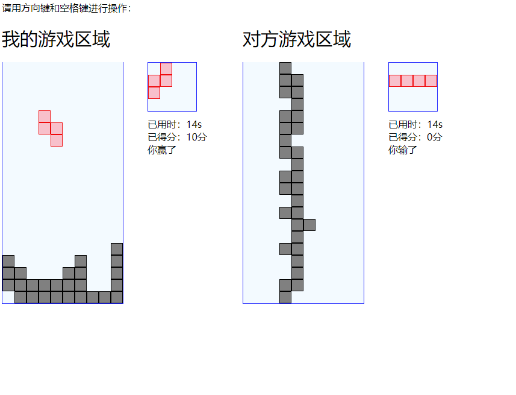
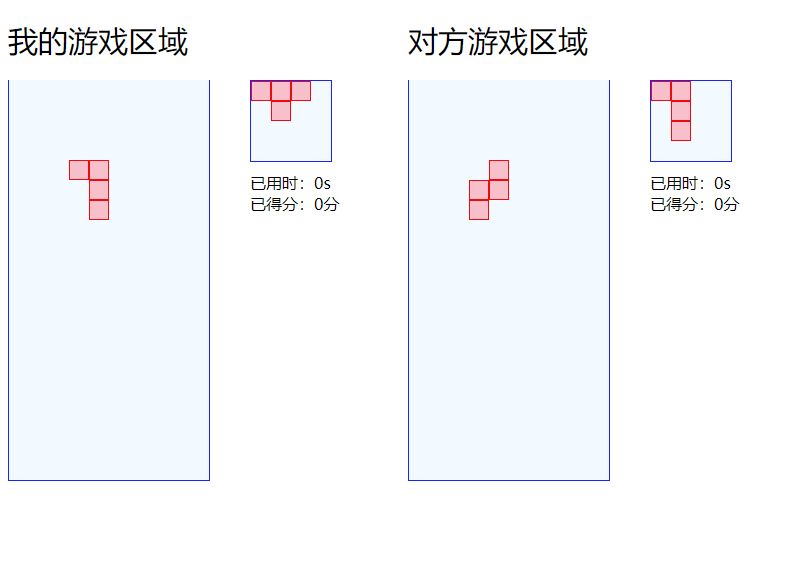

# Tetris
基于websocket原理，实现可以两人实时对战的俄罗斯方块

使用socket.io实现websocket

游戏中增加干扰系统，当自己消行多于1行时，会为对方底部增加相应的干扰行

 # 游戏内景
 
 
 

# 安装依赖
```javascript
npm run install
```
# 开启本地服务器localhost:3000
```javascript
npm run start
```